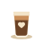

<div align="center">
  
  <h1>Kapehan</h1>
  <p><em>Free, hand-drawn coffee icons. ☕</em></p>
</div>

---

**Kapehan** (Filipino for *coffee house*) is a small set of coffee-themed SVG icons — a love letter
to Barako. They're drawn on the same grid as [Lucide](https://lucide.dev) (24×24, `currentColor`
stroke, 2px, round caps), so they sit cleanly next to your existing UI icon set and inherit text
colour and size for free.

## Icons

| | | | |
|---|---|---|---|
| `espresso` | `americano` | `latte` | `macchiato` |
| `cappuccino` | `mocha` | `coffee-bean` | `coffee-cup` |
| `french-press` | `barako` | | |

## Use

They're plain SVGs — drop them anywhere:

```html

```

Inline (so `currentColor` follows your text/theme):

```html
<span style="color:#6f4e37">
  <!-- paste the contents of icons/espresso.svg -->
</span>
```

In React, import as a component with your bundler's SVGR (or paste the path):

```tsx
import Latte from "kapehan/icons/latte.svg";
<Latte className="h-5 w-5 text-americano" />
```

## License

The icons in [`icons/`](icons/) are **MIT** — free for personal and commercial use, no attribution
required (though a ☕ is always appreciated).

**Not** covered: BaryoDev brand assets — the BaryoDev, Kapehan, Barako, barakoCMS, Talaan, and
BaryoClub names and logos are © BaryoDev, all rights reserved. See [LICENSE](LICENSE).
