<div align="center">
  
  <h1>Kapehan</h1>
  <p><em>Free, hand-drawn coffee icons. &#9749;</em></p>
  <p>
    <a href="https://www.npmjs.com/package/kapehan"></a>
    
    
  </p>
  <p><a href="https://baryodev.github.io/Kapehan/"><strong>Browse the set</strong></a></p>
</div>

---

**Kapehan** (Filipino for *coffee house*) is a set of 37 icons for coffee shops. A love letter to Barako. Two tracks ship from the same drawings:

| Folder | Grid | Colour | For |
|---|---|---|---|
| `icons/` | 48&times;48 | full palette | marketing, merch, empty states, hero art |
| `icons/mono/` | 24&times;24 | `currentColor` | UI, favicons, buttons, embroidery, one-colour print |

The mono build is not a separate drawing. It is the same geometry with the highlight layers dropped
and every fill flattened to `currentColor`, so it inherits text colour and size and stays a clean
solid pictogram at 16px. Colour is the recommendation at 24px and up.

## Install

```bash
npm i kapehan
```

## Use

Plain ``, full colour:

```html

```

Inline mono, inherits text colour and size:

```html
<span style="color:#6F4E37">
  <!-- paste the contents of icons/mono/espresso.svg -->
</span>
```

Web component, no build step. Aliases work, so `cup-cold` finds `cold-brew`:

```html
<script type="module" src="https://unpkg.com/kapehan/kape-icon.js"></script>

<kape-icon name="barako" size="32"></kape-icon>
<kape-icon name="cup-cold" mono></kape-icon>
```

React, via your bundler's SVGR:

```tsx
import Latte from "kapehan/icons/mono/latte.svg";

<Latte className="size-5 text-[#6F4E37]" />;
```

The raw icon data, if you want to build your own component:

```js
import { icons, palette, monoOf, wrap } from "kapehan/kapehan-icons.js";
```

## The system

Every icon draws from one palette and rests on one baseline, so a row of them reads as a family
instead of a pile.

| Token | Hex | Role |
|---|---|---|
| `ink` | `#241A13` | darkest coffee, liquid, knobs |
| `roast` | `#5A3520` | coffee body |
| `brown` | `#8C5A32` | crema, mid brown, wood |
| `crema` | `#D6A164` | light crema, burlap |
| `milk` | `#F5E9D6` | foam, milk |
| `ceramic` | `#F4E8D6` | warm white ceramic |
| `ceramicDeep` | `#DBC5A4` | shadow side of ceramic |
| `barako` | `#E5901A` | brand accent |
| `barakoDeep` | `#BE7008` | accent shadow |
| `clay` | `#C2593A` | terracotta vessel |
| `clayDeep` | `#9E4025` | terracotta shadow |
| `slate` | `#A7B3BA` | metal |
| `slateDeep` | `#77878F` | metal shadow |
| `glass` | `#CBDCE3` | glassware |
| `matcha` | `#7A9B5A` | matcha |
| `matchaLight` | `#94B571` | whisked matcha crema |
| `ube` | `#8E6BA8` | ube |
| `ubeLight` | `#B392C9` | ube milk layer |
| `amber` | `#C08A3E` | brewed tea, salabat |
| `mango` | `#F0B34A` | mango |
| `citrus` | `#D9C63E` | calamansi juice |
| `leaf` | `#8FAF4E` | calamansi rind |
| `melon` | `#DE7286` | watermelon, halo-halo |
| `pandan` | `#A8C486` | buko pandan |

- **Grid**: 48&times;48, 3px optical padding, optically centred on `x=24`.
- **Baseline**: everything rests on `y=42`. Saucer lips at `cy 39.4 / 40.6`.
- **Vessels** pick exactly one of ceramic, clay, barako or slate/glass. A non-coffee drink may introduce ONE hue token of its own (matcha, ube, amber, mango, citrus), held at the same muted chroma so it still sits in a row with the coffee icons. Liquid always runs ink to crema; foam is always milk. Ceramic is deliberately warm-tinted, not white, because pure white ceramic disappears on the light backgrounds these icons actually sit on.
- **Strokes**: steam and drizzle 2px round cap; handles 3 to 3.8px, drawn *behind* the body.
- **Flat fills only**, no outlines, so the artwork survives 16px and screen printing alike.

## Icons

### Drinks

| | Name | Aliases |
|---|---|---|
|  | `espresso` | `shot`, `cup-sm` |
|  | `americano` | `long-black`, `cup-black` |
|  | `latte` | `glass-latte`, `cup-tall` |
|  | `macchiato` | `cup-marked`, `piccolo` |
|  | `cappuccino` | `cup-foam`, `capp` |
|  | `mocha` | `cup-choco`, `mochaccino` |
|  | `barako` | `kapeng-barako`, `cup-barako` |
|  | `cold-brew` | `iced`, `cup-cold` |
| 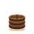 | `tablea` | `tsokolate`, `cacao-tablet` |

### Tea & more

| | Name | Aliases |
|---|---|---|
|  | `tea` | `hot-tea`, `tsaa` |
|  | `matcha` | `green-tea-latte`, `usucha` |
|  | `salabat` | `ginger-tea`, `ginger` |
|  | `hot-chocolate` | `cocoa`, `tsokolate-drink` |
| 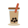 | `milk-tea` | `boba`, `pearl-tea` |
|  | `ube-latte` | `ube`, `purple-yam` |

### Tropical

| | Name | Aliases |
|---|---|---|
|  | `mango-shake` | `shake`, `smoothie` |
| 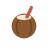 | `buko-juice` | `coconut`, `buko` |
|  | `calamansi` | `citrus`, `juice` |
| 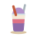 | `halo-halo` | `halohalo`, `shaved-ice` |
|  | `sago-gulaman` | `samalamig`, `gulaman` |
|  | `buko-pandan` | `pandan`, `coconut-pandan` |
|  | `watermelon-shake` | `pakwan`, `melon-shake` |
| 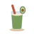 | `avocado-shake` | `avocado`, `green-shake` |
|  | `pineapple-juice` | `pinya`, `pineapple` |

### Vessels

| | Name | Aliases |
|---|---|---|
| 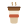 | `coffee-cup` | `takeaway`, `cup-togo` |

### Beans

| | Name | Aliases |
|---|---|---|
| 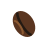 | `coffee-bean` | `bean` |
|  | `coffee-sack` | `sack`, `beans-bag` |
|  | `drip-bag` | `sachet`, `drip-sachet` |
|  | `stamp-card` | `loyalty`, `punch-card` |

### Brewers

| | Name | Aliases |
|---|---|---|
| 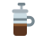 | `french-press` | `press`, `plunger` |
|  | `pour-over` | `v60`, `dripper` |
| 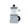 | `moka-pot` | `moka`, `stovetop` |
| 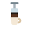 | `aeropress` | `press-air` |
|  | `barako-pot` | `palayok`, `clay-pot` |
| 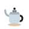 | `kettle` | `gooseneck`, `tea-kettle` |

### Equipment

| | Name | Aliases |
|---|---|---|
| 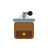 | `grinder` | `mill`, `gilingan` |
| 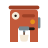 | `espresso-machine` | `machine`, `barista-bar` |

## Contributing an icon

[`kapehan-icons.js`](kapehan-icons.js) is the only file you edit. Both SVG tracks, the web
component and the site's data are generated from it:

```bash
npm run build         # regenerate icons/, icons/mono/, kape-icon.js, docs/
npm test              # fails if anything on disk drifted from the source
npm run test:browser  # drives the component and the site in a real browser
npm run serve         # then open http://localhost:4173/docs/
```

`npm test` needs nothing installed. `npm run test:browser` needs `npm ci` and
`npx playwright install chromium` first. CI runs both on every pull request.

Draw on the 48&times;48 grid, rest it on `y=42`, use only palette tokens, and mark any pure-highlight
layer with `data-mono="drop"` so the mono build stays legible. If flattening would cost the icon its
defining feature, add a hand-drawn `monoBody` (see `coffee-bean`, `latte` and `stamp-card`, where the
crease, heart and stamps become negative space via `fill-rule="evenodd"`) and the generator will use
it instead. Add the entry with `name`, `aliases`, `tags` and `category`, run the build, and commit
the generated files with it.

## License

The icons in [`icons/`](icons/) are **MIT**: personal and commercial use, in products and on merch
you sell. No attribution required.

If they earned a spot in something you're proud of, a star on GitHub, a link back, or a share is
always welcome. None of it is required. If you do want to credit it:

```html
Coffee icons by <a href="https://github.com/BaryoDev/Kapehan">Kapehan</a> &middot; MIT
```

**Not** covered: BaryoDev brand assets. The BaryoDev, Kapehan, Barako, barakoCMS, Talaan and
BaryoClub names and logos are &copy; BaryoDev, all rights reserved. See [LICENSE](LICENSE).
